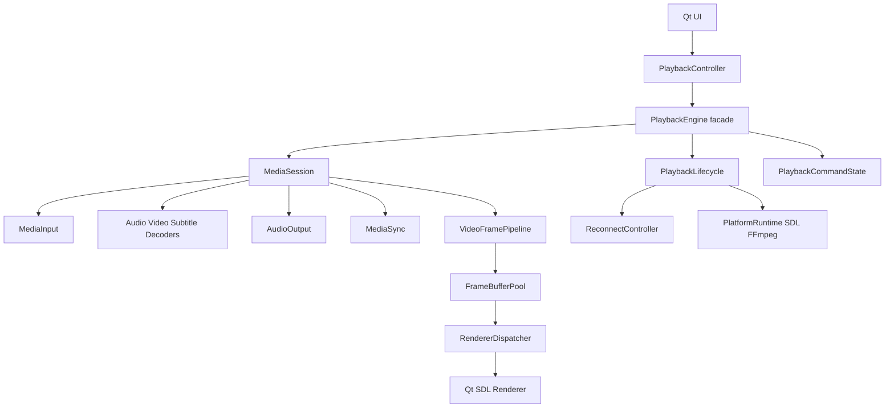
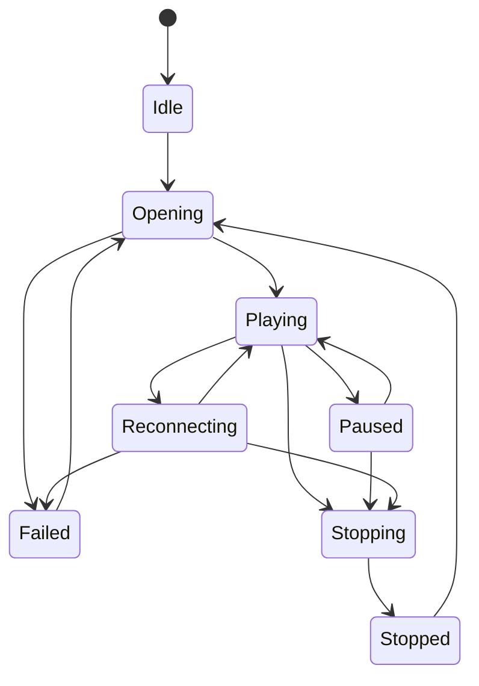

# MyPlayer 完整完善方案

建议采用“**先稳定、再提速、后重构**”的方式推进，不进行一次性重写。整个方案可拆成 7 个阶段，预计单人投入约 **25～40 个工作日**，其中前两个阶段完成后即可显著改善崩溃、卡死和播放一致性。

---

## 一、总体目标

### 稳定性目标

- 网络重连、停止和退出过程中不再卡死。
- 连续播放、切换媒体、切换音轨时无资源泄漏。
- 消除已知跨线程数据竞争。
- SDL、FFmpeg 初始化失败后允许安全重试。
- 播放音量、速度、循环策略在切换媒体后保持一致。

### 性能目标

- 稳态播放期间不再每帧动态分配大块内存。
- 调整窗口尺寸时不反复创建 SDL Renderer。
- 降低 BGRA 转换和纹理上传开销。
- 建立帧率、丢帧、队列长度和解码耗时指标。
- 为后续硬件解码保留接口，但第一阶段不直接引入硬件解码。

### 工程化目标

- 支持仅构建 `play_core`。
- 构建、测试、依赖版本可复现。
- 提供 Windows CI、自动测试和便携包验证。
- 测试覆盖真实媒体解码、生命周期、网络状态和 UI。
- 文档与实际构建配置保持同步。

---

# 二、目标架构



`VideoCtl` 暂时保留为兼容门面，现有 `PlaybackController` API 不需要一次性改变。内部能力逐步迁移到独立组件。

---

# 三、阶段 0：建立基线和回归保护

预计：**1～2 天**

在修改播放核心前，先建立可以重复验证的基线。

## 1. 增加测试分类

建议目录调整为：

```text
tests/
├── unit/
│   ├── media_source_tests.cpp
│   ├── reconnect_policy_tests.cpp
│   ├── volume_tests.cpp
│   ├── packet_queue_tests.cpp
│   └── media_session_tests.cpp
├── integration/
│   ├── playback_lifecycle_tests.cpp
│   ├── media_decode_tests.cpp
│   └── network_interrupt_tests.cpp
├── ui/
│   └── show_widget_tests.cpp
├── data/
│   ├── short-audio.wav
│   ├── short-video.mp4
│   └── audio-video-sync.mp4
└── source_contract/
    └── packaging_contract_tests.cpp
```

当前 `tests/show_widget_tests.cpp` 实际是源代码字符串匹配测试，应：

- 重命名为 `packaging_contract_tests` 或 `source_contract_tests`；
- 新增真正基于 Qt Test 的 `Show` 控件测试；
- 避免用字符串匹配代替行为测试。

## 2. 为已知问题先编写失败测试

至少覆盖：

- 连续打开 10 次媒体，音量保持不变；
- 重连等待过程中调用 `stopAndWait()`；
- 重连等待过程中析构 `PlaybackRuntime`；
- SDL 初始化失败后再次创建实例；
- 播放过程中修改循环策略；
- 快速连续 seek；
- 多次开始、停止、重新开始；
- 音轨和字幕轨切换。

## 3. 建立运行指标

增加仅在 Debug 或测试构建启用的统计结构：

```cpp
struct PlaybackMetrics {
    std::uint64_t decodedFrames = 0;
    std::uint64_t renderedFrames = 0;
    std::uint64_t droppedFrames = 0;
    std::uint64_t allocatedFrameBuffers = 0;
    std::chrono::microseconds averageDecodeTime{};
    std::chrono::microseconds averageConvertTime{};
    std::size_t peakVideoQueueSize = 0;
};
```

先记录现状，再判断后续优化是否有效。

### 阶段验收

- 已知问题均有可复现测试或压力测试。
- 测试按 `unit`、`integration`、`ui` 分类。
- 不再把源代码字符串测试命名为 Widget 测试。

---

# 四、阶段 1：修复阻塞、初始化和音量问题

预计：**3～5 天**

这是最高优先级阶段。

## 1. 统一停止和析构流程

当前 `OnStop()`、`OnStopAndWait()`、析构和重新播放拥有多套停止逻辑，容易出现遗漏。

建议新增内部方法：

```cpp
enum class StopReason {
    User,
    ReplacedByNewMedia,
    Shutdown,
    PlaybackFinished,
    FatalError
};

void requestStop(StopReason reason);
void stopAndWaitInternal(StopReason reason);
```

统一顺序：

1. 设置停止状态；
2. 设置 `m_reconnectCancelled = true`；
3. 唤醒 `m_reconnectCv`；
4. 设置当前会话 I/O 取消标志；
5. 通知读取线程；
6. 等待播放循环线程；
7. 等待读取和解码线程；
8. 关闭音频设备；
9. 销毁当前会话；
10. 在所有锁释放后发送停止事件。

重连等待必须改为带谓词：

```cpp
const bool cancelled = m_reconnectCv.wait_for(
    lock,
    delay,
    [this] {
        return m_reconnectCancelled.load(std::memory_order_acquire);
    });

if (cancelled)
    return;
```

`canReconnect` 也必须检查全局取消状态，不能只检查会话的 `abort_request`。

## 2. 引入平台运行时管理器

新增：

```text
play_core/platform_runtime.h
play_core/platform_runtime.cpp
```

建议接口：

```cpp
class PlatformRuntime {
public:
    static std::shared_ptr<PlatformRuntime> Acquire();

private:
    PlatformRuntime();
};
```

内部使用互斥量统一管理：

- SDL Audio 子系统；
- FFmpeg network 初始化；
- 初始化状态；
- 初始化错误；
- 活跃实例数。

不要再由 `VideoCtl` 析构函数无条件执行引用计数减法。

对于 SDL，优先使用：

```cpp
SDL_InitSubSystem(SDL_INIT_AUDIO);
SDL_QuitSubSystem(SDL_INIT_AUDIO);
```

避免 `SDL_Quit()` 关闭其他模块使用的视频或输入子系统。

## 3. 修复音量单位

删除混合语义的 `startup_volume`，改为：

```cpp
std::atomic<double> m_volume{0.30}; // 始终为 0.0～1.0
```

统一转换函数：

```cpp
int ToSdlVolume(double normalized)
{
    const double value = std::clamp(normalized, 0.0, 1.0);
    return static_cast<int>(std::lround(value * SDL_MIX_MAXVOLUME));
}
```

要求：

- `setVolume()` 只保存归一化值；
- 每次创建音频会话时从归一化值计算 SDL 音量；
- 增减音量也同步更新归一化值；
- 切换媒体不修改保存的音量单位；
- 设置保存和加载都使用同一个范围。

## 4. 修复 Qt 动画泄漏

创建动画时设置 QObject parent：

```cpp
m_stCtrlbarAnimationShow =
    new QPropertyAnimation(ui->CtrlBarWid, "geometry", this);
m_stCtrlbarAnimationHide =
    new QPropertyAnimation(ui->CtrlBarWid, "geometry", this);
```

也可以改成 `std::unique_ptr<QPropertyAnimation>`，但 Qt 对象优先使用父子生命周期即可。

### 阶段验收

- 网络重连过程中退出 100 次，无卡死。
- 连续播放不同媒体 100 次，无音量漂移。
- SDL 初始化失败后再次初始化可以恢复。
- Stop、Start、析构的所有线程均能在设置的超时内退出。
- Debug 和 Release 行为一致。

---

# 五、阶段 2：建立明确的并发模型

预计：**5～8 天**

## 1. 定义线程职责

建议明确以下线程：

| 线程 | 允许负责的内容 |
|---|---|
| UI/控制线程 | 下发命令、读取快照、接收事件 |
| 生命周期线程 | 打开、停止、重连、销毁会话 |
| ReadThread | FFmpeg 解封装和 seek 消费 |
| DecodeThread | 音频、视频、字幕解码 |
| SDL Audio Callback | 只读取实时音频状态，不阻塞 |
| Render/UI Thread | 接收并显示最新视频帧 |

原则：

- 只有生命周期线程可以创建和销毁 `VideoState`。
- 其他线程只能在会话有效期内使用它。
- 会话销毁前必须完成所有工作线程的停止和 join。
- SDL 音频回调不得持有可能长时间阻塞的互斥量。

## 2. 原子化简单状态

适合改为原子的字段：

```cpp
std::atomic_bool abortRequested{false};
std::atomic_bool paused{false};
std::atomic<int> audioVolume{0};
std::atomic<double> playbackRate{1.0};
std::atomic<VideoLoopPolicy> loopPolicy{LOOP_ALL};
```

`audio_callback_time` 不应是静态全局变量，应改为音频回调局部值：

```cpp
const auto callbackTime = av_gettime_relative();
```

音频帧等待计时使用另一个局部变量，不能复用回调入口时间。

## 3. 将 seek 封装为完整命令

不要由多个无同步字段表示 seek：

```cpp
struct SeekRequest {
    std::int64_t position = 0;
    std::int64_t relative = 0;
    int flags = 0;
};
```

在 `SessionState` 中使用：

```cpp
std::mutex seekMutex;
std::optional<SeekRequest> pendingSeek;
```

UI 线程写入完整请求，读取线程一次性取走：

```cpp
std::optional<SeekRequest> consumeSeekRequest();
```

这样不会出现 `seek_req` 已更新但 `seek_pos` 仍是旧值的问题。

## 4. 封装 PacketQueue

将以下成员改为私有：

- `abort_request`
- `serial`
- `size`
- `nb_packets`
- `duration`
- `mutex`
- `cond`

提供线程安全接口：

```cpp
bool aborted() const;
int serial() const;
QueueStats snapshot() const;
bool hasEnoughPackets(const AVStream* stream) const;
```

`QueueStats` 应在同一次加锁中获取，避免多个统计字段来自不同时间点。

## 5. 事件必须在锁外发送

当前部分 `SigVideoVolume`、`SigPlaybackStatus` 等事件在持锁状态下发送。如果回调再次调用控制接口，可能形成锁重入或死锁。

统一规则：

```cpp
{
    std::lock_guard lock(mutex);
    // 修改状态
}
// 锁外发送信号
SigPlaybackStatus(status);
```

## 6. 建立状态机

建议使用明确状态：

```cpp
enum class PlaybackState {
    Idle,
    Opening,
    Playing,
    Paused,
    Reconnecting,
    Stopping,
    Stopped,
    Failed
};
```

合法转换示例：



状态转换由生命周期组件串行执行，UI 不能直接修改内部字段。

### 阶段验收

- ThreadSanitizer 支持的平台上，核心测试无数据竞争报告。
- seek、暂停、循环策略压力测试通过。
- `PacketQueue` 不再暴露可变同步字段。
- 所有信号和回调均在内部锁外执行。
- 切换音轨或字幕轨不会与解码线程并发销毁资源。

---

# 六、阶段 3：优化视频帧和 SDL 渲染

预计：**4～7 天**

## 1. 引入帧缓冲池

新增：

```text
play_core/video_frame_pool.h
play_core/video_frame_pool.cpp
```

使用固定数量缓冲区，例如 3 个：

```cpp
class VideoFramePool {
public:
    std::shared_ptr<VideoFrame> acquire(
        int width,
        int height,
        PixelFormat format);
};
```

要求：

- 分辨率不变时不重新分配；
- 分辨率变化时按需扩容；
- UI 消费完成后自动归还；
- 缓冲池耗尽时优先丢弃旧帧，而不是无限分配。

## 2. 增加像素格式描述

扩展 `VideoFrame`：

```cpp
enum class VideoPixelFormat {
    BGRA,
    YUV420P,
    NV12
};

struct VideoPlane {
    const std::uint8_t* data = nullptr;
    int stride = 0;
};

struct VideoFrame {
    int width = 0;
    int height = 0;
    VideoPixelFormat format = VideoPixelFormat::BGRA;
    std::array<VideoPlane, 3> planes{};
    std::shared_ptr<void> storage;
};
```

第一步仍可使用 BGRA，但接口先支持多格式。之后 Qt SDL Renderer 可以使用：

- `SDL_UpdateTexture`：BGRA；
- `SDL_UpdateYUVTexture`：YUV420P；
- `SDL_UpdateNVTexture`：支持时使用 NV12。

## 3. 使用“最新帧优先”策略

UI 渲染慢于解码时，不应把每一帧都排入 Qt 事件队列。

`RendererDispatcher` 应只保留最新待显示帧：

```cpp
std::atomic<std::shared_ptr<VideoFrame>> pendingFrame;
```

或使用容量为 1～2 的有界队列。新帧到来时替换尚未显示的旧帧，并增加丢帧统计。

## 4. SDL Renderer 生命周期独立

新增：

```text
apps/qt_player/sdl_video_renderer.h
apps/qt_player/sdl_video_renderer.cpp
```

由该类负责：

- SDL window；
- renderer；
- texture；
- 当前纹理格式和尺寸；
- 资源重建；
- 黑屏和帧显示。

窗口 resize 时：

- 不销毁 renderer；
- 只重新计算目标矩形；
- 分辨率变化时才重建 texture；
- 原生窗口句柄变化时才重建 window/renderer。

## 5. 后续可选优化

完成基线测量后再考虑：

- FFmpeg 硬件解码；
- D3D11 共享纹理；
- NV12 GPU 转换；
- 音视频解码线程优先级；
- 更智能的丢帧策略。

这些不应和并发修复放在同一个提交中。

### 阶段验收

- 稳态播放时帧缓冲分配次数保持稳定。
- 拖动窗口不会持续创建 SDL Renderer。
- 1080p 播放 CPU 占用和内存带宽较基线明显下降。
- UI 阻塞时视频帧队列不会无限增长。
- 分辨率切换、全屏切换和停止后黑屏行为正确。

---

# 七、阶段 4：拆分核心和 UI 大类

预计：**5～8 天**

## 1. 保留 VideoCtl 作为门面

短期保持现有接口：

```cpp
class VideoCtl {
public:
    bool StartPlay(const MediaSource&);
    void OnPause();
    void OnStop();
    void OnStopAndWait();
    // ...
};
```

内部逐步委托给：

```text
play_core/
├── playback_engine.*
├── playback_lifecycle.*
├── reconnect_controller.*
├── stream_reader.*
├── audio_output.*
├── track_controller.*
├── video_frame_pipeline.*
└── platform_runtime.*
```

## 2. 重构 MediaSession 所有权

目标是让会话具备唯一所有权：

```cpp
using MediaSessionPtr =
    std::unique_ptr<VideoState, VideoStateDeleter>;
```

但在完成资源拆分前，不建议直接机械替换当前 `MediaSession`。应先把：

- SDL Audio device；
- decoder thread；
- FFmpeg context；
- frame/packet queues；

迁移为各自可独立析构的 RAII 对象。

`MediaSession::reset(session.get())` 这种自重置行为应显式拒绝或安全处理。

## 3. 拆分 MainWid

建议拆为：

```text
apps/qt_player/
├── mainwid.*
├── playback_coordinator.*
├── window_state_controller.*
├── fullscreen_controller.*
├── menu_builder.*
├── recent_files_controller.*
└── playback_position_store.*
```

职责：

- `MainWid`：只负责控件组合；
- `PlaybackCoordinator`：连接 UI 与 `PlaybackController`；
- `FullscreenController`：全屏和控制栏动画；
- `MenuBuilder`：菜单 JSON、快捷键和 QAction；
- `PlaybackPositionStore`：播放位置的延迟保存；
- `RecentFilesController`：最近文件管理。

### 阶段验收

- `videoctl.cpp` 控制在约 800～1200 行以内。
- `mainwid.cpp` 控制在约 400～600 行以内。
- `PlaybackController` 对 UI 的公开 API 保持兼容。
- 每个组件均有明确单一职责和独立测试。

---

# 八、阶段 5：构建、依赖和打包完善

预计：**3～5 天**

## 1. 修复 CMake 版本声明

推荐直接提升为：

```cmake
cmake_minimum_required(VERSION 3.25)
```

因为现有 `CMakePresets.json` 已使用 version 6。同步更新：

- `README.md`
- `docs/PROJECT_GUIDE.md`
- 发布清单

如果必须兼容 CMake 3.20，则应将 Preset schema 降级，而不是只修改文档。

## 2. 增加组件开关

```cmake
option(MYPLAYER_BUILD_QT_APP "Build Qt application" ON)
option(MYPLAYER_BUILD_TESTS "Build tests" ON)
option(MYPLAYER_ENABLE_WARNINGS "Enable compiler warnings" ON)
option(MYPLAYER_ENABLE_SANITIZERS "Enable sanitizers" OFF)
```

标准测试控制：

```cmake
include(CTest)

if(BUILD_TESTING AND MYPLAYER_BUILD_TESTS)
    add_subdirectory(tests)
endif()
```

只有构建 Qt 应用时才查找 Qt。

## 3. 增加编译警告

新增：

```text
cmake/CompilerWarnings.cmake
cmake/Sanitizers.cmake
```

MSVC 建议：

```text
/W4
/permissive-
/Zc:preprocessor
```

Clang/GCC 建议：

```text
-Wall
-Wextra
-Wpedantic
-Wconversion
-Wshadow
```

先不全局启用 `warnings as errors`，避免第三方头文件阻塞构建。第三方 include 可标记为 `SYSTEM`。

## 4. 固定依赖版本

`vcpkg.json` 增加固定 baseline。建立统一策略：

- `MYPLAYER_USE_BUNDLED_DEPS=ON`：离线 Windows 构建；
- `MYPLAYER_USE_BUNDLED_DEPS=OFF`：通过 vcpkg/system package 查找；
- CI 使用固定 vcpkg commit；
- 文档记录 FFmpeg、SDL、SoundTouch 的确切版本和构建参数。

逐步引入新的 `MYPLAYER_*` 变量，同时暂时兼容旧 `PLAYERDEMO_*`：

```cmake
if(DEFINED PLAYERDEMO_FFMPEG_ROOT AND
   NOT DEFINED MYPLAYER_FFMPEG_ROOT)
    set(MYPLAYER_FFMPEG_ROOT "${PLAYERDEMO_FFMPEG_ROOT}")
endif()
```

## 5. 统一安装和打包

完善 `install()`：

- Qt 应用；
- FFmpeg/SDL/SoundTouch DLL；
- Qt plugins；
- LICENSE、NOTICE、THIRD-PARTY-NOTICES；
- README；
- 必要配置文件。

打包脚本不要硬编码版本和 SoundTouch 路径。版本应来自 CMake：

```cmake
project(myplayer VERSION 1.0.0)
```

可以生成部署元数据供 PowerShell 使用，或迁移到 CPack。

## 6. 仓库体积治理

推荐优先级：

1. 保持现状但补充依赖版本和校验值；
2. 大型 DLL 改用 Git LFS；
3. 预编译依赖改为 Release 附件；
4. 最终由 vcpkg 完整管理。

不要未经协调直接重写 Git 历史。历史清理会影响所有现有 clone 和分支，应作为独立仓库维护操作。

显式补充忽略项：

```gitignore
/build/
/bin/
/dist/
/.vs/
playlistfile_tests-*/
```

### 阶段验收

- 全新环境按 README 可以完成配置。
- 可以只构建 `play_core` 和单元测试。
- Debug、Release preset 均可用。
- 便携包可在未安装 Qt 的干净 Windows 环境启动。
- 安装包内许可证和第三方通知完整。
- 打包版本自动来自项目版本。

---

# 九、阶段 6：CI、质量和发布体系

预计：**3～5 天**

## 1. Windows CI

建议流水线：

```text
Configure
→ Build Debug
→ Run unit tests
→ Build Release
→ Run integration tests
→ Package portable ZIP
→ Package smoke test
→ Upload artifacts
```

矩阵至少覆盖：

- MSVC 2022 Debug；
- MSVC 2022 Release。

## 2. 静态分析和 Sanitizer

建议加入：

- clang-format 检查；
- clang-tidy；
- MSVC `/analyze`，可定期运行；
- AddressSanitizer；
- ThreadSanitizer，在支持的平台构建核心测试；
- CMake configure 验证；
- PowerShell PSScriptAnalyzer，可选。

## 3. 网络测试分层

自动 CI 不依赖公网直播地址。网络测试分为：

- 单元测试：错误映射、URL 分类、重连延迟、脱敏；
- 本地集成测试：启动本地 HTTP 测试服务器；
- 手工 QA：RTSP、UDP、真实直播源；
- 长时间稳定性测试：2～8 小时。

## 4. 安全和隐私补充

扩展 URL 脱敏字段：

```text
token
access_token
signature
sig
key
api_key
password
auth
authorization
```

HTTP header 名和值应拒绝 `\r` 和 `\n`，防止构造非法 header block。

日志中禁止输出：

- URL 用户名和密码；
- Authorization；
- Cookie；
- 完整 token；
- 本地用户敏感路径，可配置是否脱敏。

## 5. 发布门禁

每次正式发布必须满足：

- Debug/Release 构建通过；
- 全部自动测试通过；
- 便携包干净环境启动通过；
- 本地文件播放通过；
- 网络流播放、断网、重连通过；
- seek、暂停、倍速、音轨、字幕通过；
- 2 小时以上稳定播放；
- 无明显内存持续增长；
- LICENSE 和 NOTICE 完整；
- 源码发布要求满足 GPL。

---

# 十、文档完善

需要同步更新：

- `README.md`
- `docs/PROJECT_GUIDE.md`
- `docs/player-qa-checklist.md`
- `docs/release-checklist.md`
- `THIRD-PARTY-NOTICES.md`

建议新增：

```text
docs/
├── architecture.md
├── threading-model.md
├── dependency-versions.md
├── troubleshooting.md
├── performance-testing.md
└── adr/
    ├── 0001-playback-state-machine.md
    ├── 0002-frame-buffer-pool.md
    └── 0003-dependency-management.md
```

`threading-model.md` 应明确每个字段由哪个线程读写、使用何种同步方式，这是防止后续重新引入数据竞争的关键文档。

---

# 十一、推荐提交拆分

不要把所有优化压在一个提交中，建议按以下顺序：

1. `Add playback lifecycle regression tests`
2. `Fix shutdown during network reconnect`
3. `Manage SDL and FFmpeg runtime safely`
4. `Keep playback volume in normalized units`
5. `Synchronize playback command state`
6. `Encapsulate packet queue synchronization`
7. `Pool video frame buffers`
8. `Preserve SDL renderer across resizes`
9. `Split playback lifecycle from VideoCtl`
10. `Split main window responsibilities`
11. `Add optional CMake components`
12. `Make packaging use CMake metadata`
13. `Add Windows build and test workflow`
14. `Document playback threading model`

每个提交都应保持可构建、可测试，避免形成无法回退的大型重构。

---

# 十二、最终验收标准

## 功能

- 本地和网络媒体播放正常。
- 暂停、seek、倍速、循环、音量行为一致。
- 网络断开可重连，停止可立即取消重连。
- 连续切换媒体不会改变用户设置。
- 音轨和字幕轨切换稳定。

## 稳定性

- 1000 次 Start/Stop 压力测试无卡死。
- 重连期间退出 100 次无卡死。
- 长时间播放无持续内存增长。
- 核心测试无 sanitizer 错误。
- 支持平台上的 ThreadSanitizer 无数据竞争。

## 性能

- 稳态视频播放不再每帧申请新缓冲区。
- resize 不再重建 SDL Renderer。
- 帧队列有上限，UI 阻塞不会导致内存无限增长。
- 1080p 播放指标较修改前有可量化改善。

## 工程

- 新环境可按文档构建。
- Preset 与最低 CMake 版本一致。
- 可以独立构建 `play_core`。
- CI 自动构建、测试和打包。
- 发布包依赖、许可证和版本信息完整。

建议首先实施**阶段 0 和阶段 1**，它们可以在保持现有外部接口不变的情况下，解决退出卡死、初始化计数和音量漂移等最直接的问题。
