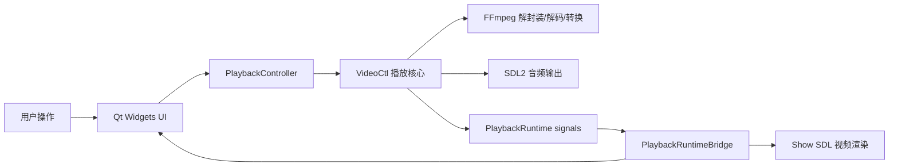
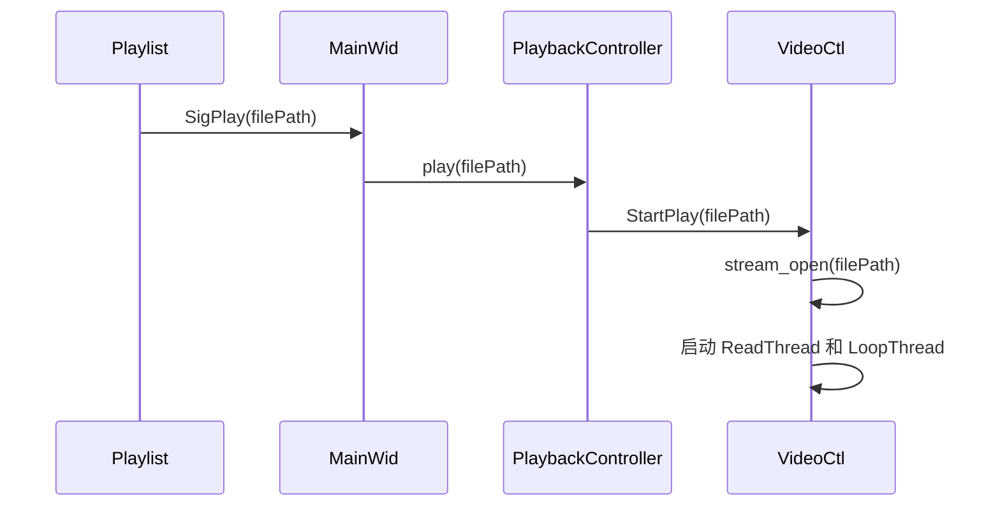
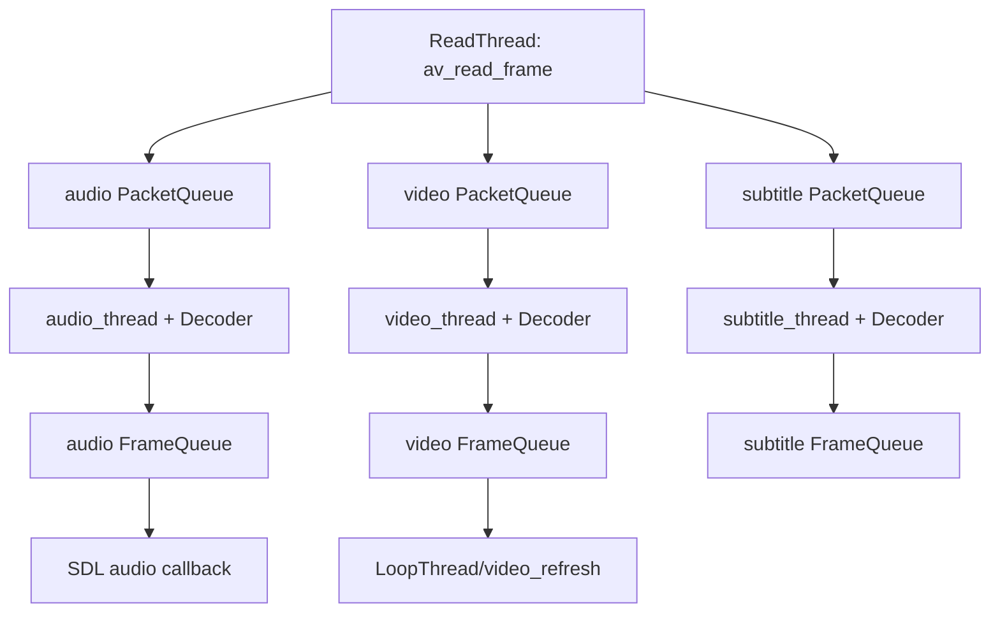

# MyPlayer 项目快速上手与架构说明

本文面向第一次接触本仓库的开发者，目标是帮助你快速完成三件事：

1. 跑起来：知道如何配置、构建、运行和测试项目。
2. 看明白：理解代码目录、模块职责、主要类和调用关系。
3. 改得动：知道新增功能或排查问题时应该从哪里入手，以及为什么当前实现要这样分层。

---

## 1. 项目定位

`MyPlayer` 是一个基于 C++20、Qt Widgets、FFmpeg、SDL2 和 SoundTouch 的本地播放器示例项目。它来自 `itisyang/playerdemo`，当前仓库在原项目基础上做了二次整理，重点是把播放核心逐步从 Qt UI 中拆出来，形成可复用的 `play_core` 静态库。

项目当前应用入口：

- `MyPlayer`：Qt Widgets 桌面播放器，完整 UI，主入口在 `apps/qt_player/main.cpp`。

公共播放能力集中在：

- `play_core/`：播放核心、解封装、解码、同步、队列、音频处理、视频帧派发。

---

## 2. 技术栈与外部依赖

| 组件 | 作用 |
| --- | --- |
| C++20 | 主要开发语言，项目顶层 CMake 强制启用 C++20 |
| CMake 3.20+ | 构建系统 |
| Qt 6 Core/Gui/Widgets | Qt 版播放器 UI |
| FFmpeg | 解封装、流选择、解码、重采样、像素格式转换、滤镜 |
| SDL2 | 音频设备输出，Qt 显示区域上的视频渲染窗口/Renderer |
| SoundTouch | 音频变速处理 |
| sigslot | `play_core` 内部事件通知，避免播放核心依赖 Qt |

第三方二进制依赖默认从仓库 `lib/` 读取：

```text
lib/
├── ffmpeg/
├── SDL2/
├── soundtouch-2.3.3/
└── sigslot-1.2.3/
```

顶层 CMake 允许通过 cache 变量替换这些路径：

```text
PLAYERDEMO_DEPS_ROOT
PLAYERDEMO_FFMPEG_ROOT
PLAYERDEMO_SDL2_ROOT
PLAYERDEMO_SOUNDTOUCH_ROOT
PLAYERDEMO_SIGSLOT_ROOT
PLAYERDEMO_QT_ROOT
PLAYERDEMO_OUTPUT_DIR
```

---

## 3. 构建与运行

### 3.1 推荐环境

Windows 下推荐：

- Visual Studio 2022
- Qt 6，例如 `C:/Qt/6.9.3/msvc2022_64`
- vcpkg，并设置 `VCPKG_ROOT`
- CMake 3.25+（`CMakePresets.json` 使用 version 6 schema）

### 3.2 使用 Preset 构建

仓库提供了 `CMakePresets.json`：

```powershell
cmake --preset windows-msvc-vcpkg
cmake --build --preset windows-msvc-vcpkg-debug
```

Release：

```powershell
cmake --build --preset windows-msvc-vcpkg-release
```

如果 Qt 不在 CMake 默认搜索路径，可以显式指定：

```powershell
cmake -S . -B build -G "Visual Studio 17 2022" -A x64 `
  -DCMAKE_TOOLCHAIN_FILE="$env:VCPKG_ROOT/scripts/buildsystems/vcpkg.cmake" `
  -DPLAYERDEMO_QT_ROOT="C:/Qt/6.9.3/msvc2022_64"
```

### 3.3 输出文件

默认输出到仓库根目录的 `bin/`：

```text
bin/myplayer_debug.exe
bin/myplayer.exe
```

Windows 下构建后，CMake 会把 FFmpeg、SDL2、SoundTouch 运行时 DLL 复制到目标输出目录。

### 3.4 测试

顶层 CMake 当前注册了五个测试：

```text
playback_settings_tests
playlistfile_tests
play_core_refactor_tests
network_playback_tests
show_widget_tests
```

运行：

```powershell
ctest --preset windows-msvc-vcpkg-debug
```

或者：

```powershell
ctest --test-dir build -C Debug --output-on-failure
```

---

## 4. 目录结构

```text
playerdemo/
├── apps/
│   └── qt_player/             # Qt Widgets 版播放器
├── play_core/                 # 播放核心静态库
├── tests/                     # 单元/结构回归测试
├── lib/                       # 随仓库提供的第三方依赖
├── docs/                      # 文档、设计记录、实施计划
├── bin/                       # 默认运行时输出目录
├── CMakeLists.txt             # 顶层构建脚本
├── CMakePresets.json          # Windows + MSVC + vcpkg 构建预设
└── vcpkg.json                 # vcpkg 依赖声明
```

### 4.1 `apps/qt_player`

Qt 版播放器主要由这些类组成：

| 文件/类 | 职责 |
| --- | --- |
| `main.cpp` | 创建 `QApplication`，启动主窗口 |
| `MainWid` | 主窗口，负责组合标题栏、播放区域、控制栏、播放列表、菜单和播放核心 |
| `Title` | 自定义标题栏，处理关闭、最小化、最大化、全屏、打开文件和菜单入口 |
| `Show` | 视频显示区域，负责接收核心输出的 BGRA 帧并通过 SDL 渲染 |
| `CtrlBar` | 底部播放控制栏，负责进度、音量、播放/暂停、停止、循环模式、倍速 |
| `Playlist` | 播放列表容器，负责添加、双击播放、上一首、下一首、随机播放 |
| `MediaList` | 播放列表内部的 `QListWidget`，负责右键菜单、添加文件/目录、导入导出列表 |
| `PlaylistFile` | M3U/M3U8 播放列表读写逻辑 |
| `GlobalHelper` | 样式、图标、配置、播放设置、最近文件、播放位置等工具方法 |
| `PlaybackRuntimeBridge` | 把 `play_core` 的 sigslot 事件转成 Qt signals，并投递到 Qt 主线程 |
| `CustomSlider` | 支持点击/拖动即时触发的进度条/音量条 |

### 4.2 `play_core`

| 文件/类 | 职责 |
| --- | --- |
| `VideoCtl` | 播放引擎核心，负责打开文件、启动线程、控制播放、处理 seek/volume/speed/loop、派发事件 |
| `PlaybackRuntime` | 面向 UI 层的运行时对象，持有 `VideoCtl` 和 `PlaybackController` |
| `PlaybackController` | UI 调用播放核心的窄接口，用一组 `std::function` 转发命令 |
| `CreatePlaybackController(VideoCtl&)` | 把 `PlaybackController` 的动作绑定到具体 `VideoCtl` 实例 |
| `VideoState` | 当前媒体的完整播放状态，按 session/audio/video/subtitle/filter/clocks 分组 |
| `MediaSession` | RAII 包装当前 `VideoState*`，负责切换媒体时关闭旧会话 |
| `Decoder` | 封装 FFmpeg 解码循环，消费 `PacketQueue`，输出 `AVFrame`/`AVSubtitle` |
| `PacketQueue` | 线程安全的压缩包队列，读线程写入，解码线程读取 |
| `FrameQueue` | 线程安全的解码帧队列，解码线程写入，播放/刷新逻辑读取 |
| `Clock` | 音频、视频、外部时钟的统一抽象 |
| `MediaSync` | 音视频同步算法，选择主时钟并计算视频帧目标延迟 |
| `RendererDispatcher` | 对外派发视频帧和尺寸变化事件 |
| `VideoFrame` | UI 层可直接消费的视频帧数据，当前为 BGRA buffer |
| `soundtouch_wrap` | SoundTouch C 接口包装 |
| `XLogger` | 日志工具 |
| `signal.h` | `sigslot::signal` 类型别名 |

---

## 5. 总体架构

当前项目最重要的架构边界是：播放核心不依赖 Qt，Qt 只是其中一个 UI。



这个分层解决的问题：

- `VideoCtl` 可以被 Qt 或未来其他 UI 复用。
- 播放核心线程不直接操作 Qt 控件，避免跨线程 UI 调用。
- UI 只拿到 `PlaybackController`，不会直接依赖 `VideoCtl` 的大量内部方法。
- 核心事件通过 `sigslot` 发出，再由 `PlaybackRuntimeBridge` 用 `QMetaObject::invokeMethod(..., Qt::QueuedConnection)` 投递回 Qt 主线程。

---

## 6. Qt 应用启动流程

Qt 版启动入口：

```text
apps/qt_player/main.cpp
  -> 创建 QApplication
  -> 创建 MainWid
  -> MainWid::Init()
  -> show()
  -> QApplication::exec()
```

`MainWid::Init()` 的关键工作：

1. 调用 `PlaybackRuntime::Create()` 创建播放运行时。
2. 从 runtime 获取 `PlaybackController`。
3. 将 controller 传给 `Show`，使显示区域也能处理快捷键、右键菜单等控制操作。
4. 恢复窗口状态、播放设置。
5. 初始化播放列表、标题栏、显示区、控制栏。
6. 调用 `ConnectSignalSlots()` 建立 UI 内部和 UI/核心之间的连接。
7. 初始化菜单、全局事件过滤器和控制栏动画。

核心代码关系：

```text
MainWid::Init()
  -> PlaybackRuntime::Create()
       -> VideoCtl::MakeInstance()
       -> CreatePlaybackController(*VideoCtl)
       -> PlaybackRuntime::connectSignals()
  -> m_playbackController = &m_playbackRuntime->controller()
  -> ui->ShowWid->SetPlaybackController(m_playbackController)
```

---

## 7. UI 到播放核心的命令链路

以点击播放列表中的文件为例：



控制栏操作类似：

| 用户动作 | Qt signal | MainWid 转发 | VideoCtl 方法 |
| --- | --- | --- | --- |
| 播放/暂停 | `CtrlBar::SigPlayOrPause` | `controller.pause()` | `VideoCtl::OnPause()` |
| 停止 | `CtrlBar::SigStop` | `controller.stop()` | `VideoCtl::OnStop()` |
| 拖动进度 | `CtrlBar::SigPlaySeek(double)` | `controller.seek(percent)` | `VideoCtl::OnPlaySeek()` |
| 调整音量 | `CtrlBar::SigPlayVolume(double)` | `controller.setVolume(percent)` | `VideoCtl::OnPlayVolume()` |
| 倍速 | `CtrlBar::SigSpeedChanged(double)` | `controller.setSpeed(speed)` | `VideoCtl::set_play_speed()` |
| 循环模式 | `CtrlBar::SigPlayLoopPolicyChanged` | `controller.setLoopPolicy(policy)` | `VideoCtl::set_play_loop_policy()` |
| 上一首/下一首 | `SigBackwardPlay` / `SigForwardPlay` | 转给 `Playlist` | `Playlist::OnBackwardPlay()` / `OnForwardPlay()` |

`PlaybackController` 的实现很轻：它只是保存一组 `std::function`，每个 public 方法先判断函数是否存在，再转发调用。这样 UI 只依赖一个稳定的小接口，不需要知道 `VideoCtl` 里的线程、队列、FFmpeg 状态。

---

## 8. 播放核心生命周期

### 8.1 创建

```text
PlaybackRuntime::Create()
  -> VideoCtl::MakeInstance()
       -> new VideoCtl()
       -> VideoCtl::Init()
            -> ConnectSignalSlots()
            -> SDL_Init(SDL_INIT_AUDIO)
       -> shared_ptr<VideoCtl>
  -> new PlaybackRuntime(videoCtl)
       -> CreatePlaybackController(*videoCtl)
       -> connectSignals()
```

`VideoCtl` 构造函数中会：

- 设置 `MediaSession` 的关闭回调为 `stream_close(state)`。
- 设置 `RendererDispatcher` 的尺寸变化和帧回调。
- 调用 `avdevice_register_all()`。
- 使用全局引用计数初始化 FFmpeg network。

`Init()` 中会：

- 连接内部 signal。
- 使用全局引用计数初始化 SDL audio。

为什么要用引用计数：

- 项目允许创建多个 `VideoCtl` 实例，不是真正单例。
- FFmpeg network 和 SDL 是进程级资源，不能每个实例随意 init/deinit。
- 引用计数保证第一个实例初始化，最后一个实例析构时清理。

### 8.2 开始播放

`VideoCtl::StartPlay(const std::string& fileName)` 是播放入口：

1. 用 `m_playbackMutex` 串行化播放启动/停止。
2. 校验文件名。
3. 停止旧的刷新循环线程 `m_tPlayLoopThread`。
4. 发出 `SigStartPlay(fileName)`，让 UI 更新标题等状态。
5. 调用 `stream_open(fileName.c_str())` 创建新的 `VideoState`。
6. 用 `MediaSession::reset(is)` 接管新状态，并关闭旧状态。
7. 启动 `LoopThread()`，负责刷新、同步和帧显示。

### 8.3 关闭

关闭路径主要有三类：

- UI 调用 `controller.stop()`，最终进入 `VideoCtl::OnStop()`。
- `PlaybackRuntime::~PlaybackRuntime()` 调用 `m_controller.stopAndWait()`。
- `VideoCtl::~VideoCtl()` 停止循环线程，释放 `MediaSession`，调用 `stream_close()`。

`MediaSession` 是这里的关键保护：切换媒体或析构时，当前 `VideoState*` 只通过一个 RAII 对象管理，避免新旧播放状态混在一起。

---

## 9. `VideoState` 的状态分组

`VideoState` 是播放核心最重要的数据结构。旧式播放器常把所有状态放在一个巨大的结构体里，本项目已经拆分成多个小结构：

```text
VideoState
├── MediaClockState clocks
├── AudioState audio
├── VideoTrackState video
├── SubtitleState subtitle
├── FilterState filters
└── SessionState session
```

各分组职责：

| 分组 | 内容 |
| --- | --- |
| `SessionState` | 读线程、abort/pause/seek/eof 状态、输入格式上下文、文件名、流索引、读线程条件变量 |
| `MediaClockState` | 音频时钟、视频时钟、外部时钟、当前同步策略 |
| `AudioState` | 音频队列、音频解码器、SDL 输出缓冲、重采样上下文、SoundTouch 句柄、音量、音频流 |
| `VideoTrackState` | 视频帧队列、视频解码器、视频流、帧计时、丢帧统计、Sws 转换上下文、画面尺寸 |
| `SubtitleState` | 字幕队列、字幕解码器、字幕流、字幕转换上下文 |
| `FilterState` | FFmpeg 音视频滤镜图和输入/输出 filter context |

为什么这样拆：

- 减少“所有函数都访问所有字段”的混乱。
- 让读代码时可以按音频、视频、字幕、同步、会话生命周期分块理解。
- 方便测试：`play_core_refactor_tests.cpp` 通过 `static_assert` 固化了这些分组存在。
- 方便后续继续把某些分组演进成类。

---

## 10. 解封装、队列和解码线程

播放核心采用典型的生产者/消费者模型：



### 10.1 `ReadThread`

`VideoCtl::ReadThread(VideoState* is)` 负责：

1. 创建 `AVFormatContext`。
2. 设置 `interrupt_callback`，让 abort 时可以打断 FFmpeg 阻塞读取。
3. `avformat_open_input()` 打开文件。
4. `avformat_find_stream_info()` 探测流信息。
5. `av_find_best_stream()` 选择最佳音频、视频、字幕流。
6. 调用 `stream_component_open()` 打开每个流。
7. 循环调用 `av_read_frame()`。
8. 根据 packet 的 stream index 放入 audio/video/subtitle `PacketQueue`。

它不直接解码。这样做的原因是读取封装包和解码帧速度不同，必须用队列解耦，否则 UI seek、暂停、网络流缓冲都会很难处理。

### 10.2 `PacketQueue`

`PacketQueue` 保存压缩包 `AVPacket`，使用 SDL mutex/cond 实现线程安全：

- `put()`：读线程写入 packet。
- `get()`：解码线程读取 packet，可阻塞等待。
- `abort()`：唤醒等待线程并让 get 返回退出。
- `flush()`：清空队列。
- `serial`：标记 seek 后的新数据代次，避免旧帧混入新位置。

队列里保留了一些 public 字段，是为了兼容从 C 风格结构迁移到 C++ class 的过渡期。新代码应优先调用成员函数。

### 10.3 `Decoder`

`Decoder::decode_frame()` 包装 FFmpeg 新解码 API：

```text
PacketQueue::get()
  -> avcodec_send_packet()
  -> avcodec_receive_frame()
```

它处理这些情况：

- packet 队列 abort。
- seek 后 serial 变化。
- `AVERROR(EAGAIN)`。
- EOF/null packet。
- 音频、视频、字幕三类解码差异。

### 10.4 `FrameQueue`

`FrameQueue` 保存解码后的 `AVFrame` 或 `AVSubtitle`：

- `peek_writable()`：解码线程拿到可写 slot。
- `push()`：写入完成后推进写索引并唤醒读者。
- `peek_readable()`：消费线程等待可读帧。
- `peek_last()` / `peek_next()`：视频同步时查看当前帧和下一帧。
- `next()`：消费当前帧。

它是固定大小环形队列，适合播放器场景：不追求无限缓存，而是控制延迟和内存。

---

## 11. 音频路径

音频从文件到扬声器的路径：

```text
ReadThread
  -> audio PacketQueue
  -> audio_thread()
  -> Decoder::decode_frame()
  -> audio FrameQueue
  -> SDL audio callback
  -> audio_decode_frame()
  -> swr_convert()
  -> SoundTouch 变速
  -> SDL_MixAudioFormat()
```

关键函数：

| 函数 | 作用 |
| --- | --- |
| `stream_component_open()` | 打开音频流、创建 codec context、启动音频解码线程、打开 SDL audio device |
| `audio_thread()` | 解码音频 packet，生成音频 frame，写入 `sampq` |
| `sdl_audio_callback()` | SDL 请求音频数据时回调，向 SDL stream 填充 PCM |
| `audio_decode_frame()` | 从音频帧队列取 frame，处理同步、重采样、变速和缓冲 |
| `synchronize_audio()` | 根据主时钟调整音频采样数量，帮助音视频同步 |
| `set_play_speed()` | 修改播放速度，音频通过 SoundTouch 或滤镜链处理 |

为什么音频用 SDL callback：

- SDL audio 设备按自己的节奏拉取数据。
- 播放器只需要在回调中及时提供 PCM。
- 音频时钟天然适合作为默认主时钟，因为听觉对音频抖动更敏感。

---

## 12. 视频路径与渲染

视频从文件到 Qt 界面的路径：

```text
ReadThread
  -> video PacketQueue
  -> video_thread()
  -> Decoder::decode_frame()
  -> queue_picture()
  -> video FrameQueue
  -> LoopThread/video_refresh()
  -> video_display()
  -> emit_video_frame()
  -> sws_scale(..., AV_PIX_FMT_BGRA)
  -> RendererDispatcher
  -> PlaybackRuntimeBridge
  -> Show::OnVideoFrame()
  -> SDL_UpdateTexture()
  -> SDL_RenderPresent()
```

### 12.1 `video_thread()`

`video_thread()` 消费视频 packet，解码得到 `AVFrame`，计算：

- `pts`：展示时间戳。
- `duration`：帧持续时间。
- `serial`：当前 packet 队列代次。

然后调用 `queue_picture()` 放入视频帧队列。

如果启用 `CONFIG_AVFILTER`，会在帧尺寸、格式、serial 或滤镜索引变化时重建滤镜图，并通过 `setpts` 实现视频倍速。

### 12.2 `LoopThread()` 与 `video_refresh()`

`LoopThread()` 是播放刷新循环，它会周期性调用 `video_refresh()`。`video_refresh()` 根据当前主时钟、视频帧 pts 和目标 delay 决定：

- 当前帧是否该显示。
- 是否要等待。
- 是否因为太慢需要丢帧。
- 播放结束时根据循环策略触发下一首、随机或停止。

### 12.3 `emit_video_frame()`

`emit_video_frame()` 从 `FrameQueue` 当前帧构造 UI 友好的 `VideoFrame`：

1. 创建 `std::shared_ptr<VideoFrame>`。
2. 申请 `width * height * 4` 的 BGRA buffer。
3. 用 `sws_getCachedContext()` 获取/复用像素格式转换上下文。
4. 用 `sws_scale()` 把 FFmpeg 原始像素格式转换为 `AV_PIX_FMT_BGRA`。
5. 调用 `RendererDispatcher::dispatchFrame(frame)`。

为什么转换成 BGRA：

- UI 层无需理解 YUV、NV12 等复杂像素格式。
- Qt/SDL/D3D texture 都容易消费 32-bit BGRA/RGBA buffer。
- 核心与渲染层之间的数据契约更简单。

### 12.4 `Show` 如何显示视频

`Show` 接收 `PlaybackRuntimeBridge::SigVideoFrame` 后：

1. 保存当前 `VideoFrame`。
2. 调用 `RenderCurrentFrame()`。
3. 如果 SDL renderer/texture 不存在则懒初始化。
4. 当帧尺寸变化时重建 SDL texture。
5. `SDL_UpdateTexture()` 更新 BGRA 数据。
6. `SDL_RenderCopy()` + `SDL_RenderPresent()` 显示。

`Show::ChangeShow()` 根据视频宽高比调整内部 label 的 geometry，确保画面居中并保持比例。

为什么在 Qt 控件里再用 SDL 渲染：

- SDL 渲染 texture 简单直接，适合频繁刷新视频帧。
- Qt 负责窗口、布局、菜单、交互；SDL 负责高频像素显示。
- `SDL_CreateWindowFrom(ui->label->winId())` 可以把 SDL renderer 挂到 Qt 子控件上。

---

## 13. 音视频同步

同步逻辑集中在 `MediaSync`：

| 函数 | 作用 |
| --- | --- |
| `get_master_sync_type()` | 根据配置和流是否存在选择主时钟 |
| `get_master_clock()` | 返回当前主时钟时间 |
| `check_external_clock_speed()` | 根据队列缓冲情况调节外部时钟速度 |
| `compute_target_delay()` | 根据视频时钟与主时钟的差值修正视频帧 delay |
| `vp_duration()` | 根据当前帧和下一帧 pts 计算当前帧持续时间 |
| `update_video_pts()` | 更新视频时钟并同步外部时钟 |

默认策略是 `AV_SYNC_AUDIO_MASTER`，即音频为主时钟。如果没有音频流，会回退到外部时钟。

为什么默认音频主时钟：

- 人耳对音频卡顿、变调更敏感。
- 音频设备的回调节奏相对稳定。
- 视频帧可以通过延迟/重复/丢帧追赶音频，体验上更可接受。

---

## 14. 事件系统：sigslot 到 Qt signal

播放核心用 `signal.h` 中的别名：

```cpp
template<typename... Args>
using Signal = sigslot::signal<Args...>;
```

`VideoCtl` 发出的核心事件包括：

```text
SigPlayMsg
SigFrameDimensionsChanged
SigVideoFrame
SigVideoTotalSeconds
SigVideoPlaySeconds
SigVideoVolume
SigPauseStat
SigStop
SigStopFinished
SigStartPlay
SigPlayNextOne
SigRandomPlayOne
```

事件转发链路：

```text
VideoCtl::SigVideoFrame
  -> PlaybackRuntime::SigVideoFrame
  -> PlaybackRuntimeBridge::SigVideoFrame
  -> Show::OnVideoFrame
```

`PlaybackRuntimeBridge` 的实现重点：

- 保存 `sigslot::scoped_connection`，析构或 `detach()` 时自动断开。
- 使用 `QPointer<PlaybackRuntimeBridge>` 防止异步投递时对象已销毁。
- 使用 `QMetaObject::invokeMethod(..., Qt::QueuedConnection)` 把事件投递到 Qt 主线程。

为什么需要 bridge：

- `VideoCtl` 的事件可能来自读线程、解码线程或刷新线程。
- Qt 控件只能在 UI 主线程访问。
- 直接从核心线程调用 Qt slot 会产生随机崩溃或 UI 状态竞争。

---

## 15. 播放列表与文件格式

播放列表相关类：

| 类 | 作用 |
| --- | --- |
| `MediaList` | 列表控件和右键菜单 |
| `Playlist` | 播放列表业务逻辑 |
| `PlaylistFile` | M3U/M3U8 读写 |

### 15.1 添加和播放文件

`Playlist::OnAddFileAndPlay()`：

1. 调用 `AddFileItem()`。
2. 校验是否支持的媒体扩展名。
3. 校验文件存在且是普通文件。
4. 使用 canonical path 去重。
5. 创建 `QListWidgetItem`。
6. 复用 `on_List_itemDoubleClicked()` 发出 `SigPlay(filePath)`。

支持的扩展名：

```text
.mkv .rmvb .mp4 .avi .flv .wmv .3gp
```

### 15.2 M3U/M3U8 读取

`PlaylistFile::ReadM3u()` 做了比较宽容的兼容处理：

- 先按 UTF-8 读取，如果出现 replacement character，再按本地编码读取。
- 支持相对路径，基于播放列表文件所在目录解析。
- 支持 `file:///` URL。
- 支持百分号编码路径。
- 支持 `#EXTINF` 标题回退，用于某些播放器导出的列表只有标题没有路径的情况。
- 对文件名做大小写不敏感匹配。
- 去重并返回 canonical path。

为什么实现复杂：

- 现实里的 M3U 文件并不总是规范。
- VLC 等工具可能把真实路径放在下一行，也可能只在 `#EXTINF` 标题里保留文件名。
- 用户导入播放列表时更关心“能不能识别”，而不是格式是否严格。

### 15.3 M3U8 写出

`PlaylistFile::WriteM3u8()` 使用 `QSaveFile`：

- 写入 UTF-8。
- 第一行写 `#EXTM3U`。
- 每个文件写 canonical native path。
- `commit()` 成功后才替换目标文件。

为什么用 `QSaveFile`：

- 避免写到一半失败导致原播放列表损坏。
- 这是保存配置/列表类文件时更安全的做法。

---

## 16. 设置、样式和资源

### 16.1 配置

`GlobalHelper` 负责：

- 播放列表保存/读取。
- 音量保存/读取。
- 窗口 geometry/state 保存/恢复。
- 播放设置保存/读取：音量、循环模式、倍速。
- 最近文件保存/读取。
- 播放位置保存/读取。
- 时间格式化。

这些设置通过 Qt 配置机制保存，UI 层不直接操作文件细节。

### 16.2 样式

Qt 样式文件位于：

```text
apps/qt_player/res/qss/
```

其中 `design-system.css` 定义全局设计 token，各组件 QSS 再叠加自己的样式。`GlobalHelper::GetThemeStr()` 会把设计系统样式和组件样式组合起来。

资源清单在：

```text
apps/qt_player/mainwid.qrc
```

新增图标、字体、QSS、JSON 菜单时要同步检查 qrc。

### 16.3 菜单

菜单 JSON：

```text
apps/qt_player/res/menu.json
```

`MainWid::InitMenu()` 读取 JSON，`MenuJsonParser()` 递归创建 `QMenu` 和 `QAction`，`ConnectMenuAction()` 根据 action 配置连接到具体 slot。

---

## 17. 关键类速查

### 17.1 `PlaybackRuntime`

位置：

```text
play_core/playback_runtime.h
play_core/playback_runtime.cpp
```

职责：

- 创建并持有 `VideoCtl`。
- 创建 `PlaybackController`。
- 把 `VideoCtl` 的 signals 转发为 runtime 自己的 signals。
- 析构时调用 `stopAndWait()`，确保后台播放停止。

它是 UI 层最应该持有的播放核心对象。

### 17.2 `PlaybackController`

位置：

```text
play_core/playback_controller.h
play_core/playback_controller.cpp
play_core/playback_controller_videoctl.cpp
```

职责：

- 为 UI 提供稳定、窄的控制接口。
- 不拥有播放状态。
- 不依赖 FFmpeg/SDL/Qt。
- 当前具体实现通过 `CreatePlaybackController(VideoCtl&)` 绑定到 `VideoCtl`。

新增 UI 控制命令时，一般需要：

1. 在 `PlaybackController::Actions` 增加一个 `std::function`。
2. 在 `PlaybackController` 增加 public 方法。
3. 在 `CreatePlaybackController(VideoCtl&)` 绑定到 `VideoCtl` 方法。
4. 在 Qt UI 中调用 controller 方法。

### 17.3 `VideoCtl`

位置：

```text
play_core/videoctl.h
play_core/videoctl.cpp
```

职责：

- 播放核心的调度中心。
- 管理当前 `VideoState`。
- 启动/停止读线程、音频解码线程、视频解码线程、字幕解码线程、刷新循环线程。
- 处理播放、暂停、停止、seek、音量、倍速、循环模式、切换音轨/字幕。
- 通过 signals 把进度、音量、暂停状态、视频帧、播放结束等事件发给上层。

需要注意：

- `VideoCtl` 很大，是历史代码和新分层共存的中心。
- 新增 UI 功能时不要直接把 Qt 类型引入这里。
- 新增核心事件时用 `Signal<...>`，再由 bridge 转成 Qt signal。
- 修改线程、队列、生命周期时必须跑测试，并尽量增加回归测试。

### 17.4 `VideoState`

位置：

```text
play_core/video_state.h
```

职责：

- 保存当前媒体播放所需的全部运行状态。
- 通过析构函数释放部分资源，例如读线程、FFmpeg context、SDL cond/mutex、SoundTouch、SWR/SWS context。

它不是 UI 状态，也不是全局播放器状态；它代表“当前打开的一个媒体会话”。

### 17.5 `RendererDispatcher`

位置：

```text
play_core/renderer_dispatcher.h
play_core/renderer_dispatcher.cpp
```

职责：

- 接收核心生成的 `VideoFrame`。
- 如果帧尺寸变化，先通知尺寸变化回调。
- 再通知视频帧回调。
- 忽略空帧或非法尺寸帧。

这个类把 `emit_video_frame()` 中的“帧派发策略”抽了出来，便于测试。

### 17.6 `PlaybackRuntimeBridge`

位置：

```text
apps/qt_player/playback_runtime_bridge.h
apps/qt_player/playback_runtime_bridge.cpp
```

职责：

- 将 `PlaybackRuntime` 的 sigslot signals 转换成 Qt signals。
- 保证事件在 Qt 主线程执行。
- 保护对象生命周期，避免异步 lambda 使用已销毁对象。

只要事件要进入 Qt 控件，就应该经过它。

---

## 18. 常见开发任务入口

### 18.1 新增一个播放控制按钮

例如新增“快进 30 秒”：

1. 在 `PlaybackController::Actions` 增加动作。
2. 在 `PlaybackController` 增加 public 方法。
3. 在 `CreatePlaybackController(VideoCtl&)` 绑定到 `VideoCtl`。
4. 在 `VideoCtl` 增加对应控制方法，内部调用 seek。
5. 在 `CtrlBar` 或 `Show` 增加 Qt signal。
6. 在 `MainWid::ConnectSignalSlots()` 连接到 controller。
7. 增加或更新测试。

不要让按钮直接调用 `VideoCtl`，否则 UI 和核心会重新耦合。

### 18.2 新增核心事件给 UI

例如新增“当前音轨名称变化”：

1. 在 `VideoCtl` 增加 `Signal<const std::string&> SigAudioTrackNameChanged`。
2. 在合适的核心位置触发 signal。
3. 在 `PlaybackRuntime` 增加同名 signal，并在 `connectSignals()` 转发。
4. 在 `PlaybackRuntimeBridge` 增加 Qt signal，并在 `attach()` 中用 `QMetaObject::invokeMethod` 转发。
5. 在 `MainWid::ConnectSignalSlots()` 连接到对应 UI slot。

### 18.3 修改视频渲染

优先查看：

```text
play_core/videoctl.cpp          # emit_video_frame()
play_core/renderer_dispatcher.* # 帧派发
apps/qt_player/show.cpp         # SDL texture 渲染
```

如果只是 UI 显示策略，比如铺满、等比、背景色，通常改 `Show`。如果是核心输出格式，比如 BGRA 改 RGBA，要同步检查 Qt 渲染入口。

### 18.4 修改音频变速

优先查看：

```text
play_core/videoctl.cpp          # set_play_speed(), audio_decode_frame(), audio_thread()
play_core/soundtouch_wrap.*     # SoundTouch 封装
```

注意音频和视频都要处理速度：

- 音频需要变速但尽量不变调。
- 视频需要调整帧展示时间。
- UI 需要保存/恢复倍速设置。

### 18.5 修改播放列表导入导出

优先查看：

```text
apps/qt_player/playlistfile.cpp
tests/playlistfile_tests.cpp
```

这个模块有相对独立的测试，适合先写失败用例再改实现。

---

## 19. 测试说明

### 19.1 `playlistfile_tests`

覆盖：

- 标准 M3U/M3U8 读取。
- `file:///` URL。
- VLC 风格 `#EXTINF` 标题回退。
- M3U8 导出后再读回。

这类逻辑不依赖真实播放器，适合快速回归。

### 19.2 `play_core_refactor_tests`

覆盖：

- `PlaybackRuntime` 和 `PlaybackController` 的类型边界。
- `VideoState` 分组结构。
- `MediaSession` reset/release 生命周期。
- `MediaSync` 基础行为。
- `RendererDispatcher` 尺寸变化与空帧过滤。
- `PlaybackController` 动作转发。

这个测试的价值是防止重构时破坏架构边界。

### 19.3 `show_widget_tests`

当前主要检查 `Show` 相关实现/资源是否满足预期。它更偏 UI 结构回归，不覆盖真实视频播放。

---

## 20. 排查问题指南

### 20.1 CMake 找不到 Qt

检查 `PLAYERDEMO_QT_ROOT` 或 `CMAKE_PREFIX_PATH`：

```powershell
cmake -S . -B build -DPLAYERDEMO_QT_ROOT="C:/Qt/6.9.3/msvc2022_64"
```

### 20.2 运行时缺 DLL

确认构建后输出目录包含：

- FFmpeg DLL：来自 `lib/ffmpeg/bin/*.dll`
- SDL2 DLL：来自 `lib/SDL2/lib/x64/SDL2.dll`
- SoundTouch DLL：来自 `lib/soundtouch-2.3.3/lib/SoundTouchDLL_x64.dll`

如果没有，检查 `PLAYERDEMO_*_ROOT` 是否指向正确目录。

### 20.4 播放有声音无画面

优先检查：

1. `video_thread()` 是否成功解码并调用 `queue_picture()`。
2. `LoopThread()` / `video_refresh()` 是否调用 `video_display()`。
3. `emit_video_frame()` 是否成功创建 BGRA frame。
4. `RendererDispatcher` 是否触发 `SigVideoFrame`。
5. `PlaybackRuntimeBridge` 是否投递到 Qt 主线程。
6. `Show::EnsureSdlRenderer()` 是否创建 SDL renderer 成功。
7. `Show::RenderCurrentFrame()` 是否创建 texture 并 `SDL_RenderPresent()`。

### 20.5 UI 偶发崩溃

重点检查是否有核心线程直接操作 Qt 对象。正确路径必须是：

```text
VideoCtl signal
  -> PlaybackRuntime signal
  -> PlaybackRuntimeBridge
  -> Qt queued signal
  -> QWidget slot
```

不要从 `VideoCtl`、读线程、解码线程或 SDL callback 中直接访问 QWidget。

### 20.6 seek 后画面或声音错乱

重点检查：

- `PacketQueue::serial` 是否更新。
- 解码器是否丢弃旧 serial 的 packet/frame。
- `FrameQueue` 是否 flush。
- `VideoState::session.seek_req/seek_pos/seek_rel` 是否正确设置。
- 音频、视频、字幕三个队列是否同步处理 seek。

---

## 21. 当前实现的主要设计取舍

### 21.1 为什么不是纯 Qt Multimedia

项目目标是学习和控制底层播放流程。FFmpeg + SDL 的方式可以直接处理：

- 解封装和流选择。
- 解码线程。
- 音视频同步。
- 自定义变速。
- 队列、seek、循环策略。
- 跨 UI 复用核心。

Qt Multimedia 更适合快速做播放器应用，但不利于展示和修改底层播放机制。

### 21.2 为什么播放核心不依赖 Qt

`play_core` 是静态库，供 Qt 应用使用。核心不依赖 Qt 后：

- 更容易测试。
- 更容易复用到其他 UI。
- 可以避免 Qt 主线程规则污染底层播放逻辑。
- 构建边界更清晰。

### 21.3 为什么还保留一些 C 风格代码

播放器核心明显继承了 FFmpeg 示例播放器一类的写法。FFmpeg/SDL 本身就是 C API，保留部分 C 风格可以减少迁移风险。当前仓库采用的是渐进式重构：

- 先把 `PacketQueue`、`FrameQueue`、`Clock` 封装成类。
- 再把 `VideoState` 分组。
- 再通过 `PlaybackRuntime` / `PlaybackController` 隔离 UI。
- 后续可以继续拆小 `VideoCtl`。

这种做法比一次性大改更安全，因为播放核心涉及多线程、设备回调和外部 C 库资源生命周期。

### 21.4 为什么使用 `shared_ptr<VideoFrame>`

视频帧从核心线程传到 UI 主线程，中间有异步投递。使用 `std::shared_ptr<VideoFrame>` 可以：

- 避免复制大 buffer。
- 保证异步投递期间数据仍然存活。
- 让 Qt bridge 和 UI slot 都可以安全持有同一帧。

---

## 22. 建议的阅读顺序

如果你是第一次看这个项目，建议按这个顺序读：

1. `CMakeLists.txt`：先知道目标、依赖和输出。
2. `play_core/playback_runtime.*`：理解 UI 应该怎样拿到播放能力。
3. `play_core/playback_controller.*` 和 `play_core/playback_controller_videoctl.cpp`：理解控制命令如何绑定。
4. `apps/qt_player/mainwid.cpp` 的 `Init()` 和 `ConnectSignalSlots()`：理解 Qt UI 如何连接核心。
5. `play_core/video_state.h`：理解播放状态被分成哪些部分。
6. `play_core/videoctl.cpp` 的 `StartPlay()`、`stream_open()`、`ReadThread()`：理解播放启动。
7. `play_core/packet_queue.*`、`frame_queue.*`、`decoder.*`：理解数据如何在线程之间流动。
8. `play_core/media_sync.*`：理解音视频同步。
9. `play_core/videoctl.cpp` 的 `emit_video_frame()` 和 `apps/qt_player/show.cpp`：理解画面如何显示。
10. `apps/qt_player/playlistfile.cpp` 和对应测试：作为相对独立模块练手。

---

## 23. 维护约定

建议后续开发遵守这些规则：

- UI 层不要直接包含或操作 FFmpeg/SDL 内部状态。
- `play_core` 不要引入 Qt 类型。
- 跨线程进入 Qt UI 必须经过 queued signal 或等价机制。
- 新增播放核心命令优先走 `PlaybackController`。
- 新增核心事件优先走 `VideoCtl -> PlaybackRuntime -> PlaybackRuntimeBridge`。
- 修改 `VideoCtl` 生命周期、队列、seek、线程退出时必须运行测试。
- 修改播放列表解析时必须补充 `playlistfile_tests`。
- 修改架构边界时必须补充或更新 `play_core_refactor_tests`。

---

## 24. 快速索引

| 你要做什么 | 从哪里开始 |
| --- | --- |
| 跑项目 | `CMakePresets.json`、顶层 `CMakeLists.txt` |
| 看 Qt 启动 | `apps/qt_player/main.cpp`、`apps/qt_player/mainwid.cpp` |
| 看播放核心入口 | `play_core/playback_runtime.cpp`、`play_core/videoctl.cpp` |
| 看 UI 控制播放 | `play_core/playback_controller.*`、`apps/qt_player/mainwid.cpp` |
| 看视频显示 | `play_core/renderer_dispatcher.*`、`apps/qt_player/show.cpp` |
| 看音频输出 | `play_core/videoctl.cpp` 的 `audio_open()`、`audio_decode_frame()` |
| 看同步算法 | `play_core/media_sync.*` |
| 看队列 | `play_core/packet_queue.*`、`play_core/frame_queue.*` |
| 看播放列表 | `apps/qt_player/playlist.*`、`playlistfile.*` |
| 看测试 | `tests/playlistfile_tests.cpp`、`tests/play_core_refactor_tests.cpp` |

