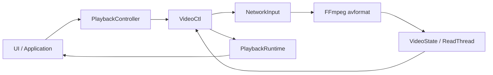
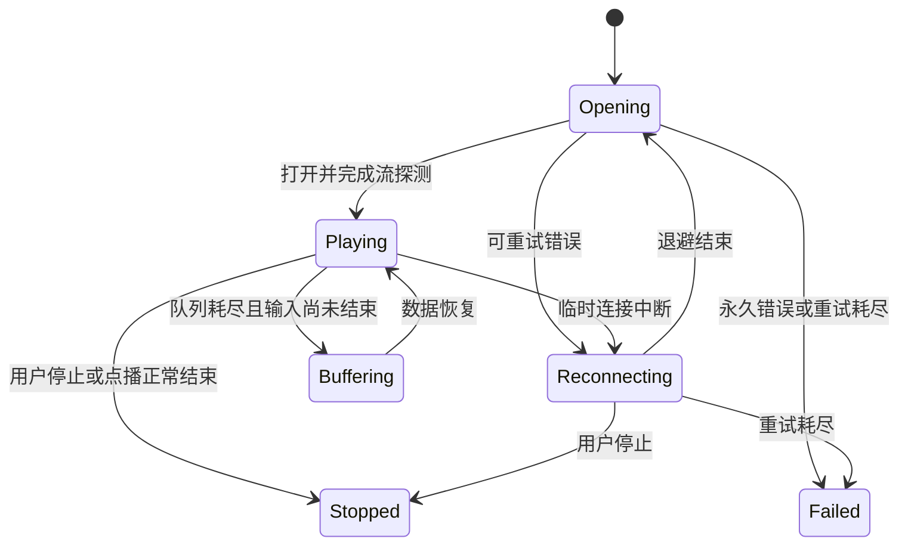

# 播放核心网络流支持设计

## 1. 目标

在不破坏现有本地文件播放和 UI 接口的前提下，为 `play_core` 增加可用于正式场景的网络流能力：

- 支持 HTTP、HTTPS、RTSP、RTP 和 UDP 输入。
- 支持每次播放独立配置连接、读取、探测、请求头和 RTSP 传输方式。
- 支持可取消的打开、探测、读取、退避和完整会话重连。
- 向应用层返回结构化播放状态、错误和媒体能力。
- 保留 `play(const std::string&)` 及现有信号，兼容 Qt 和 ImGui 调用方。
- 所有自动化测试均不依赖公网服务。

本次不新增 Qt 的“打开 URL”对话框，不改造本地播放列表的数据模型。

## 2. 当前问题

当前代码已经调用 `avformat_network_init()`，`avformat_open_input()` 也能接收 URL，并能识别部分实时协议。但它还不具备完整的网络播放语义：

- `avformat_open_input()` 没有接收网络、探测、鉴权或请求头参数。
- `interrupt_callback` 只处理停止，不能区分连接超时和读取超时。
- 读取失败后没有错误分类、退避或重连。
- `infinite_buffer` 是进程级全局变量，一个直播会话会影响后续点播会话。
- 打开失败、断流和重连过程只能通过普通文本表达，调用方无法可靠更新 UI。
- 网络流未知时长、不可 seek 等能力没有明确传递给 UI。
- 直接复用旧 `AVFormatContext` 会让解码器、流索引、队列和时钟继续引用失效状态。

## 3. 总体架构

采用独立网络输入层，保留 `VideoCtl` 作为播放生命周期协调者。



职责划分：

- `MediaSource`：描述一次播放请求。
- `NetworkOptions`：描述该请求的网络参数和重连策略。
- `NetworkInput`：识别协议、生成 FFmpeg 参数、打开输入、管理 I/O 截止时间、分类错误。
- `ReconnectPolicy`：判断错误是否可重试并计算退避时间。
- `VideoCtl`：停止旧会话、启动播放工作线程、重建完整会话、发送状态事件。
- `PlaybackController`：向 UI 暴露兼容的字符串入口和新的结构化入口。
- `PlaybackRuntime`：向应用层转发结构化状态和媒体信息。

网络协议细节不得继续散落到 Qt UI、播放列表或解码线程中。

## 4. 公共数据模型

### 4.1 媒体源

```cpp
enum class RtspTransport {
    Tcp,
    Udp
};

struct NetworkOptions {
    std::chrono::milliseconds connectTimeout{10000};
    std::chrono::milliseconds readTimeout{15000};
    std::chrono::microseconds analyzeDuration{5000000};
    std::int64_t probeSize{5 * 1024 * 1024};

    RtspTransport rtspTransport{RtspTransport::Tcp};
    std::string userAgent{"playerdemo/1.0"};
    std::map<std::string, std::string> headers;

    int maxReconnectAttempts{5};
    std::chrono::milliseconds initialReconnectDelay{1000};
    std::chrono::milliseconds maxReconnectDelay{15000};
    std::chrono::seconds stablePlaybackReset{30};
    bool reconnect{true};
};

struct MediaSource {
    std::string location;
    NetworkOptions network;
};
```

`location` 可以是 UTF-8 本地路径或 FFmpeg 支持的 URL。空地址、负超时、负重连次数和无效探测参数在创建播放任务前被拒绝。

### 4.2 状态与错误

```cpp
enum class PlaybackState {
    Opening,
    Buffering,
    Reconnecting,
    Playing,
    Failed,
    Stopped
};

enum class PlaybackError {
    None,
    Cancelled,
    Timeout,
    Authentication,
    NotFound,
    UnsupportedProtocol,
    NetworkUnavailable,
    ConnectionLost,
    InvalidMedia,
    DecoderFailure,
    Unknown
};

struct PlaybackStatus {
    PlaybackState state{PlaybackState::Stopped};
    PlaybackError error{PlaybackError::None};
    int reconnectAttempt{0};
    int maxReconnectAttempts{0};
    std::chrono::milliseconds retryAfter{0};
    std::string message;
};

struct MediaInfo {
    bool networkSource{false};
    bool live{false};
    bool seekable{false};
    std::optional<std::chrono::milliseconds> duration;
};
```

`PlaybackStatus::message` 只用于展示和诊断，程序逻辑必须使用枚举和结构化字段。

## 5. FFmpeg 输入参数

`NetworkInput` 根据媒体源协议构造并持有 `AVDictionary`，在所有返回路径释放字典。

### 5.1 通用参数

- `probesize` 使用 `NetworkOptions::probeSize`。
- `analyzeduration` 使用微秒值。
- I/O 截止时间同时由 FFmpeg 协议参数和 `interrupt_callback` 保证。

### 5.2 HTTP 和 HTTPS

- 设置 `user_agent`、`headers` 和 `rw_timeout`。
- 启用 FFmpeg 的 `reconnect`、`reconnect_streamed`、`reconnect_on_network_error`。
- HTTP 自动恢复仅针对连接错误和 500、502、503、504。
- 协议层恢复失败后，再由播放器执行完整会话重建。

### 5.3 RTSP

- `rtsp_transport` 映射为 `tcp` 或 `udp`，默认 TCP。
- 设置 RTSP `timeout` 和通用 `rw_timeout`。
- RTSP EOF 或连接中断按临时网络错误处理。

### 5.4 RTP 和 UDP

- 设置读取超时和适用的协议缓冲参数。
- 作为实时流处理，不提供时长和 seek 能力。

### 5.5 本地文件

本地文件只应用探测参数，不应用网络超时、请求头或自动重连参数。

## 6. 可取消 I/O

每个播放会话拥有独立的 I/O 控制状态：

- 原子取消标记。
- 当前操作阶段：打开、探测或读取。
- 当前操作截止时间。
- 最近一次中断原因。

`interrupt_callback` 在以下任一条件成立时返回非零：

- 用户停止当前播放。
- 用户打开新媒体，旧任务被替换。
- 播放器析构。
- 当前打开、探测或读取操作超过配置截止时间。

开始每次阻塞 FFmpeg 调用前设置对应截止时间，调用结束后清除。重连退避使用条件变量等待，停止操作会唤醒条件变量，不能用不可中断的 `sleep_for()`。

## 7. 播放与重连状态机



`StartPlay(MediaSource)` 完成请求校验、停止旧任务和启动工作线程后返回。返回 `true` 表示请求已接受，不表示 FFmpeg 已成功打开媒体；最终结果通过状态事件返回。这与当前异步打开行为一致。

默认退避序列为 1、2、4、8、15 秒。最多执行 5 次重连。连续稳定播放 30 秒后，重连计数归零。

只重试以下错误：

- `Timeout`
- `NetworkUnavailable`
- `ConnectionLost`
- HTTP 500、502、503、504

以下错误立即失败：

- 用户取消
- HTTP 401、403、404
- 不支持的协议
- 无效媒体
- 解码器初始化失败

## 8. 会话重建

中途断流后必须完整销毁旧会话，再创建新会话。重建范围包括：

- `AVFormatContext`
- 音频、视频和字幕解码器
- 包队列和帧队列
- SDL 音频设备
- 音视频时钟
- 流索引及媒体能力

不得只替换 `AVFormatContext`，因为其他对象保存了旧流和旧时间基引用。

实时流重连后从当前直播位置恢复。可 seek 的 HTTP/HTTPS 点播记录最后有效主时钟位置，重连成功后进行一次尽力恢复；服务器不支持 Range 或 seek 时从服务器返回的位置继续，并发送状态消息，但不把该情况视为永久失败。

正常本地文件或点播 EOF 不重连。实时流 EOF 视为临时断流。

## 9. 缓冲、时长与 seek

删除进程级 `infinite_buffer` 对播放行为的控制，改为每个 `VideoState` 独立保存缓冲策略：

- 实时流不使用点播队列限流条件。
- 本地文件和 HTTP 点播保留现有队列限流。
- 一个直播会话结束后不得影响后续本地文件。

媒体打开后根据格式、协议、`AVIO_SEEKABLE_NORMAL` 和 duration 生成 `MediaInfo`：

- 直播或不可 seek 输入的 `seekable` 为 `false`。
- 未知时长使用空 `duration`，兼容信号 `SigVideoTotalSeconds` 发送 `0`。
- 不可 seek 输入收到 seek 请求时不访问 `AVFormatContext`，忽略请求并发送可诊断消息。

## 10. API 与兼容性

新增：

- `PlaybackController::play(const MediaSource&)`
- `VideoCtl::StartPlay(const MediaSource&)`
- `PlaybackRuntime::SigPlaybackStatus`
- `PlaybackRuntime::SigMediaInfo`
- Qt `PlaybackRuntimeBridge` 对应的 queued signal 转发

保留：

- `PlaybackController::play(const std::string&)`
- `VideoCtl::StartPlay(const std::string&)`
- `SigPlayMsg`
- `SigStartPlay`
- `SigVideoTotalSeconds`

字符串重载构造默认 `MediaSource` 后调用结构化重载。原有 Qt 和 ImGui 调用点不需要同步修改。

## 11. 事件线程语义

核心事件可能从播放工作线程发出。`PlaybackRuntime` 保持与 Qt 无关，只同步转发核心信号。`PlaybackRuntimeBridge` 必须复制事件数据，并通过 Qt queued invocation 发送到 UI 线程；核心线程不得直接访问 QWidget。

`Opening`、`Reconnecting`、`Failed` 和 `Stopped` 每次状态迁移只发送一次。`Buffering` 只在播放已经开始且解码队列耗尽时发送，数据恢复后发送 `Playing`，避免把首次打开误报为缓冲。

## 12. 日志与敏感数据

日志、状态消息和错误文本不得包含：

- URL 中的用户名和密码。
- `Authorization` 请求头。
- `Cookie` 请求头。
- 常见 token、access_token、signature 查询参数值。

内部仍可把原始 URL 和请求头传给 FFmpeg，但所有对外诊断都必须通过统一脱敏函数处理。FFmpeg 错误码作为结构化数值保留，展示文本使用脱敏后的媒体标识。

## 13. 测试策略

新增不依赖公网的 `network_playback_tests`。测试使用真实纯逻辑类型和可注入的 FFmpeg 操作薄接口，覆盖：

- 本地路径、HTTP、HTTPS、RTSP、RTP、UDP 分类。
- 各协议 FFmpeg 字典参数。
- 默认参数和单次播放覆盖参数。
- FFmpeg 错误分类及是否允许重试。
- 1、2、4、8、15 秒退避序列和最大次数。
- 稳定播放后重置重试计数。
- URL 和请求头脱敏。
- 打开、探测和读取超时。
- 停止操作打断 I/O 和退避。
- 模拟首次失败后恢复、播放中断流后恢复、永久失败。
- `PlaybackController` 的结构化参数转发和字符串兼容入口。
- 直播不可 seek、未知时长和每会话缓冲策略。

测试不得连接外部地址。人工验收可使用维护者自有地址，不作为 CTest 成败条件。

## 14. 验收标准

自动验收：

```powershell
cmake --build build --config Debug
ctest --test-dir build -C Debug --output-on-failure
```

人工验收至少覆盖：

- HTTP/HTTPS 点播。
- RTSP TCP 和 UDP。
- 播放中断网后恢复。
- 重连等待期间停止。
- 鉴权失败不重试。
- 直播未知时长且禁用 seek。
- 播放网络流后再播放本地文件，确认缓冲策略不串会话。

## 15. 非目标

- Qt “打开 URL”对话框。
- 把 URL 保存到现有本地播放列表。
- DRM、HLS AES 密钥管理或证书管理界面。
- 自定义 AVIO、代理管理 UI、网络质量统计面板。
- 对所有第三方服务器行为提供无条件恢复保证。

